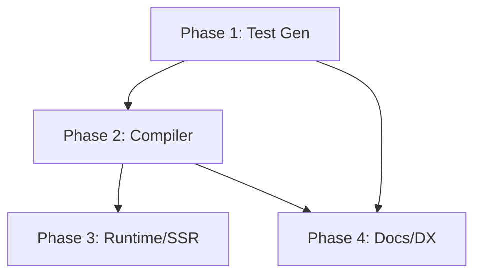

# Strategic Analysis: V4 Implementation Roadmap

## Executive Summary

This document provides a rigorous, debate-style analysis of the three strategic questions regarding the Tailwind v4 implementation for `CSSzyx`. Each question is analyzed from multiple perspectives before arriving at a recommendation.

---

## Question 1: Phase 1 (Test Suite Automation) — Which Role?

### The Debate

#### Position A: **QA Role** (Testing Focus)

**Argument:** QA owns test quality. Generating test cases is fundamentally about ensuring correctness.

**Counter:** This task is more about _creating tooling_ than _running tests_. It requires:

- Deep understanding of the spec mapping syntax
- Complex markdown parsing logic
- Schema design for test data structures

**Verdict:** QA alone is insufficient.

---

#### Position B: **Senior Dev** (Implementation Complexity)

**Argument:** The markdown parser, JSON/TS generator, and schema design require Senior-level engineering skills.

**Counter:** Senior Dev might over-engineer the solution or miss edge cases that QA would catch.

**Verdict:** Senior Dev is necessary but not sufficient.

---

#### Position C: **Executor** (Automation Scripts)

**Argument:** This is a scripting/automation task. Executor role specializes in this.

**Counter:** Executor role typically handles _running_ established scripts, not _designing_ complex parsers from scratch.

**Verdict:** Executor is the wrong fit.

---

### Recommendation: **Senior Dev + QA Collaboration**

| Role       | Responsibility                              | Output                                   |
| ---------- | ------------------------------------------- | ---------------------------------------- |
| Senior Dev | Design parser, schema, and generator        | `scripts/spec-to-tests.ts` + JSON schema |
| QA         | Validate output quality, edge case coverage | Verified test suite, gap analysis report |

**Workflow:**

1. Senior Dev creates the tooling
2. QA runs it, identifies gaps in the spec
3. Feedback loop until 100% coverage

---

## Question 2: Rust vs TypeScript for V4

### Current State Analysis

```
┌─────────────────────────────────────────────────────────────┐
│                    CSSZYX Architecture                      │
├─────────────────────────────────────────────────────────────┤
│  Build Time        │  Runtime (SSR/CSR)                     │
├────────────────────┼────────────────────────────────────────┤
│  Vite/Webpack      │  _sz() helper                          │
│  Plugin (TS)       │  (TS bundle)                           │
│        │           │        │                               │
│        ▼           │        ▼                               │
│  @csszyx/compiler  │  @csszyx/runtime                       │
│  transform() (TS)  │  concatenate() (TS)                    │
│        │           │        │                               │
│        ▼           │        ▼                               │
│  [Future: WASM?]   │  [WASM Core Engine?]                   │
└─────────────────────────────────────────────────────────────┘
```

### The Debate

#### Position A: **Full Rust/WASM for V4**

**Arguments:**

1. Tailwind v4 uses Oxide (Rust) — We should match their performance
2. We already have Rust infrastructure — Incremental extension
3. Future-proof: WASM is portable and fast

**Counter-Arguments:**

1. **Development Speed:** Rust iteration is 3-5x slower than TypeScript
2. **Complexity Tax:** Debugging cross-language (TS ↔ WASM) is painful
3. **Diminishing Returns:** The "hot path" is string manipulation — V8 is already fast for this
4. **Bundle Size:** WASM binary adds ~100KB+ — We have a <150KB target

**Critical Question:** _Is the transform function actually perf-critical?_

- Build time: **No** — Builds are inherently slow; a few ms per file is noise
- SSR runtime: **Maybe** — But most transforms are static and can be cached
- CSR runtime: **Rarely** — Dynamic class generation should be exceptional

---

#### Position B: **TypeScript-First, Rust for Hot Paths**

**Arguments:**

1. **Ship Faster:** TypeScript development is faster → Earlier v4 support
2. **Lower Risk:** No WASM debugging, simpler error messages
3. **Hybrid Option:** Can port proven hot paths to WASM later

**Counter-Arguments:**

1. We lose potential perf gains in edge cases
2. Two codebases to maintain (TS + potential future WASM)

---

#### Position C: **Keep V3 Features, Develop V4 as Branch**

**Arguments:**

1. **Stability:** V3 users are not disrupted
2. **Clean Separation:** V4 can be experimental until stable
3. **Testing:** Each version has isolated test suites

**Counter-Arguments:**

1. Codebase divergence can lead to merge hell
2. Duplicate maintenance burden

---

### Recommendation: **TypeScript-First with Modular Architecture**

```
┌─────────────────────────────────────────────────────────────┐
│                  PROPOSED V4 ARCHITECTURE                   │
├─────────────────────────────────────────────────────────────┤
│                                                             │
│   @csszyx/compiler (TypeScript)                             │
│   ┌─────────────────────────────────────────────────────┐   │
│   │  Core Transform Engine                              │   │
│   │  ┌───────────────┐    ┌───────────────┐             │   │
│   │  │ V3 Parser     │    │ V4 Parser     │  ◀── NEW   │   │
│   │  └───────┬───────┘    └───────┬───────┘             │   │
│   │          │                    │                     │   │
│   │          ▼                    ▼                     │   │
│   │  ┌───────────────────────────────────────┐          │   │
│   │  │      Unified Class Name Generator     │          │   │
│   │  │      (TS - Can be WASM in future)     │          │   │
│   │  └───────────────────────────────────────┘          │   │
│   └─────────────────────────────────────────────────────┘   │
│                                                             │
│   Config: { tailwindVersion: '3' | '4' }                    │
│                                                             │
└─────────────────────────────────────────────────────────────┘
```

**Key Decisions:**

1. **Separate Parsers:** V3 and V4 have different syntax (e.g., `bg-(--var)` is v4 only). Separate parsers, unified generator.
2. **Config-Driven:** User specifies Tailwind version in config. Compiler loads appropriate parser.
3. **WASM Escape Hatch:** Design the generator interface so it _can_ be swapped for WASM later, but don't block on it.

---

## Question 3: Parallelization Across Agents

### Dependency Graph



### Parallelization Analysis

| Task                        | Dependencies     | Can Parallel? | Risk if Parallelized                     |
| --------------------------- | ---------------- | ------------- | ---------------------------------------- |
| Phase 1: Test Gen           | Spec (done ✅)   | ✅ Yes        | Low — Self-contained                     |
| Phase 2a: V4 Parser         | Spec (done ✅)   | ✅ Yes        | Medium — Must align with Test Gen output |
| Phase 2b: Unified Generator | Phase 1 tests    | ⚠️ Partial    | High — Needs tests to validate           |
| Phase 3: Runtime/SSR        | Phase 2 complete | ❌ No         | Very High — Integration-dependent        |
| Phase 4: Types/Docs         | Phase 1 + Spec   | ✅ Yes        | Low — Type generation is isolated        |

### Proposed Parallel Workflow

```
Week 1-2:
┌─────────────────────────────────────────────────────────────┐
│  Agent A (Senior Dev)    │  Agent B (QA)                    │
│  Phase 1: Test Gen       │  Phase 4: TypeScript Types       │
│  - Parse spec.md         │  - Generate type definitions     │
│  - Generate JSON tests   │  - IntelliSense for sz props     │
└─────────────────────────────────────────────────────────────┘

Week 3-4:
┌─────────────────────────────────────────────────────────────┐
│  Agent A (Senior Dev)    │  Agent B (Senior Dev)            │
│  Phase 2a: V4 Parser     │  Phase 2b: V3 Regression Tests   │
│  - Implement new syntax  │  - Ensure v3 still works         │
│  - Use Phase 1 tests     │  - Run existing playgrounds      │
└─────────────────────────────────────────────────────────────┘

Week 5:
┌─────────────────────────────────────────────────────────────┐
│  All Agents              │                                  │
│  Phase 3: Integration    │  ← Sync point, no parallelism   │
│  - SSR Verification      │                                  │
│  - Hydration Tests       │                                  │
└─────────────────────────────────────────────────────────────┘
```

### Interface Contracts (Critical for Parallelism)

For agents to work in parallel safely, they need **shared contracts**:

#### Contract 1: Test Case Schema

```typescript
// Generated by Phase 1, consumed by Phase 2
interface TestCase {
  id: string; // Unique identifier
  szInput: Record<string, any>; // The sz prop object
  expectedClass: string; // Expected Tailwind output
  tailwindVersion: "3" | "4"; // Which version this applies to
  category: string; // e.g., "layout", "spacing"
}
```

#### Contract 2: Transform Function Signature

```typescript
// Shared by all compiler modules
type TransformResult = {
  className: string;
  attributes?: Record<string, string>; // For data-* attributes
};

type TransformFn = (
  szObject: Record<string, any>,
  options?: { version?: "3" | "4" },
) => TransformResult;
```

---

## Summary Table

| Question              | Key Insight                                | Recommendation                                           |
| --------------------- | ------------------------------------------ | -------------------------------------------------------- |
| **Role for Phase 1**  | Test gen is tooling + validation           | **Senior Dev builds, QA validates**                      |
| **Rust vs TS for V4** | Transform is not critically perf-sensitive | **TypeScript-first, WASM as future option**              |
| **Parallelization**   | Dependency graph allows some parallelism   | **Parallel Phases 1 & 4, then 2a & 2b, sync at Phase 3** |

---

## Next Steps (Pending User Decision)

1. **If User Approves Phase 1:**
   - Create `scripts/spec-to-tests.ts` parser
   - Define `TestCase` schema
   - Generate initial test suite JSON

2. **If User Approves Parallel Strategy:**
   - Create interface contracts document
   - Assign agents to respective phases
   - Set up sync points for integration

3. **If User Wants More Discussion:**
   - Deep-dive into specific concerns
   - Prototype proof-of-concept for high-risk items
